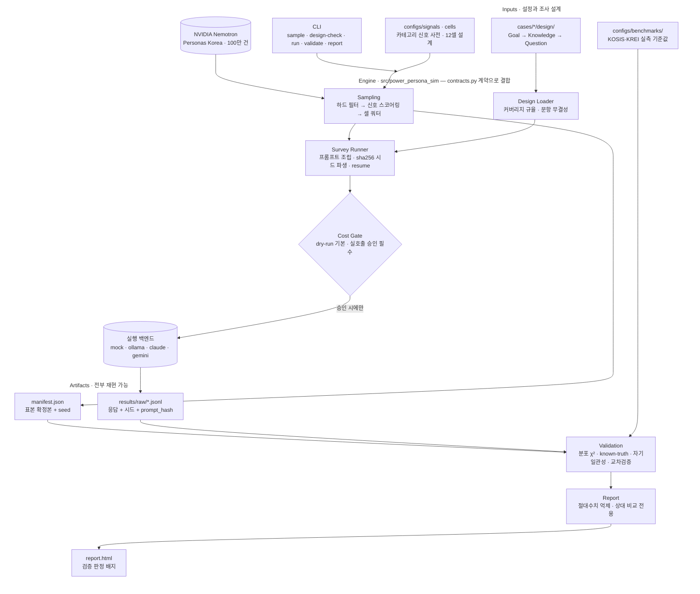

# power-persona-sim

[](https://huggingface.co/datasets/nvidia/Nemotron-Personas-Korea)

통계 정합 합성 페르소나로 인간 조사를 사전 최적화한다. NVIDIA Nemotron Personas Korea 기반 소비자 조사 시뮬레이터.

---

## 무엇을 하는 도구인가

조사 목적 한 줄을 입력하면, 100만 건의 통계 정합 합성 페르소나 중에서 목적에 맞는 표본을 골라내고, 그 페르소나들에게 설문과 심층인터뷰를 실행해 결과를 돌려준다.

```
입력   조사 목적 + 대상 조건
  │
  ├─ ① 페르소나 선별    100만 건 → 조건 매칭 → 셀 할당 → 표본 확정
  ├─ ② 조사 설계        Goal → Knowledge → Question 백워드 디자인
  ├─ ③ 시뮬레이션 실행   페르소나별 시스템 프롬프트 조립 → 배치 실행
  ├─ ④ 타당성 검증      분포 적합도 · known-truth · 자기일관성 · 멀티모델 교차
  └─ ⑤ 리포트           세그먼트별 결과 + 실제 조사로 넘길 가설
```

## 시스템 아키텍처



파이프라인을 관통하는 원칙이 둘 있다. **재현성** — run_id·파생 시드·prompt_hash가 전부 입력값의 해시라서, 같은 설문·설정·seed면 언제 어디서 돌려도 같은 실행이다. **관문** — 유료 호출 앞에는 비용 게이트가, 리포트 앞에는 검증 판정이 서 있고, 둘 다 우회할 수 없게 구조에 박혀 있다.

### 기술 구성

| 영역 | 기술 | 선정 이유 |
|---|---|---|
| Language | Python 3.12+ | 통계 검증(scipy: χ²·Kendall τ)이 도구의 본체 — 통계 생태계 필수 |
| 데이터 접근 | DuckDB(httpfs), pyarrow, pandas | 1.98 GB parquet를 내려받지 않고 HF 원격 쿼리로 필터 튜닝 |
| 인터페이스 | 정적 CLI (argparse) | 서버 없이 가장 빨리 동작하는 배치 파이프라인 |
| 리포트 | Jinja2 단일 템플릿 | 외부 CDN 없는 self-contained HTML 한 장으로 공유·보관 |
| LLM 실행 | 어댑터 패턴 (mock·ollama·claude·gemini) | 무과금 개발과 멀티모델 교차검증을 같은 코드로 |
| 검증 | scipy + KOSIS·KREI 실측 기준값 | 표본 분포·known-truth를 실제 통계와 대조 |

### 구조 선정 이유

- **`contracts.py` 계약 중심**: 6개 모듈(dataset·sampling·design·runners·validation·report)이 공유 데이터클래스와 파사드 시그니처로만 결합한다. 모듈은 서로를 모르고 계약만 안다 — 병렬 개발·교체가 자유롭다.
- **케이스와 엔진 분리**: 카테고리 지식은 전부 설정 파일(`configs/signals/*.yaml`)에, 케이스 산출물은 `cases/`에 격리. 신호 사전 하나만 갈아끼우면 다른 카테고리 조사가 된다 — 도구이지 일회성 분석이 아니다.
- **게이트를 구조에 박기**: 유료 호출 앞의 비용 게이트(dry-run 기본 + 명시 승인), 리포트 앞의 검증 판정. 규칙을 문서로 두지 않고 우회 불가능한 코드 경로로 만들었다.
- **재현성을 해시로 강제**: run_id·파생 시드·prompt_hash가 전부 입력값의 sha256이다. 같은 설문·설정·시드면 언제 어디서 돌려도 같은 실행 — 사전 등록(PREREG) 방법론의 전제 조건.

### 포기한 것

- **신속성** — 프롬프트로 즉석 페르소나를 만드는 쪽이 훨씬 빠르지만, 만든 사람의 편견이 그대로 표본이 된다. 통계 분포 표본 추출을 선택했다.
- **절대 수치의 명확성** — "43%가 동의" 같은 결론은 리포트가 구조적으로 막는다. LLM 실리콘 샘플은 극단값을 크게 과대 추정한다는 실증(아래 문헌)이 있어, 세그먼트 간 상대 순위·차이만 표시한다.
- **빠른 결과 도출** — known-truth 재현 실패 한 건이면 시뮬레이션 전체를 폐기한다. 걸러진 결과만이 인간 조사를 줄여줄 수 있다.
- **웹 앱의 상호작용성** — 필터링·드릴다운 대신 정적 파이프라인. 수백 명 배치는 실비용이 들어서, 사후 변경으로 결론이 뒤집히는 분석 자유도 문제(arXiv 2509.13397)를 PREREG 고정으로 막는 쪽이 우선이었다.

---

## 프로젝트 구조

```text
power-persona-sim/
├── src/power_persona_sim/
│   ├── contracts.py            # 모듈 간 계약 — 데이터 스키마와 파사드 시그니처
│   ├── dataset/                # HF 접근 4경로 (remote-duckdb · local-parquet · hf-datasets · fixture)
│   ├── sampling/               # 3단계 표본 추출 · 셀 할당 · manifest 저장
│   ├── design/                 # 백워드 디자인 로더 · 커버리지 규율 · 문항 무결성
│   ├── runners/                # 프롬프트 조립 · 어댑터 4종 · 비용 게이트 · 배치 실행
│   ├── validation/             # 검증 4종 · 벤치마크 로더
│   ├── report/                 # Jinja2 HTML 리포트
│   └── cli.py                  # 파이프라인 5커맨드
│
├── configs/
│   ├── signals/                # 카테고리별 신호 키워드 사전 (교체 지점)
│   ├── cells/                  # 셀 축·쿼터 설계
│   └── benchmarks/             # KOSIS·KREI 실측 기준값 (출처 부착)
│
├── cases/
│   └── cheongwayeon/           # 첫 케이스 — 설계 YAML 5종 + 제품 스펙
│
├── tests/                      # 190여 개 — 전부 오프라인 실행
├── results/                    # 원응답 jsonl(시드 포함) · manifest — 커밋 제외
├── PROJECT-BRIEF.md            # 방법론·설계 전문
├── PREREG.md                   # 사전 등록 템플릿 (실행 파라미터 고정)
└── ATTRIBUTION.md              # CC BY 4.0 저작자 표시
```

---

## 포지셔닝

이 도구는 인간 조사를 **대체하지 않는다.** 실제 가치는 인간 IDI 15명을 하기 전에 시뮬레이션 300명으로 문항을 다듬고 가설을 10개에서 3개로 줄이는 데 있다.

| 구분 | 일반적 접근 | power-persona-sim |
|---|---|---|
| 페르소나 출처 | 프롬프트로 즉석 생성 | **국가 통계에 정합한 실제 분포에서 표본 추출** |
| 대표성 | 근거 없음 | KOSIS·대법원·건보공단·KREI 기반, 셀 가중치 보정 |
| 결과 신뢰 | 나온 대로 사용 | **4단계 검증 통과분만 채택, 실패 시 폐기** |
| 포지셔닝 | 인간 조사 대체 주장 | 인간 조사의 **사전 최적화·가설 축소** |

## 사용법

### 설치

```bash
git clone https://github.com/Power-xc/power-persona-sim.git
cd power-persona-sim
python3 -m venv .venv && source .venv/bin/activate
pip install -e .            # 기본 (DuckDB 원격 쿼리·오프라인 fixture로 충분)
pip install -e ".[hf]"      # 선택 — 데이터셋 전체 다운로드가 필요할 때만
```

### 5분 데모 — 비용 0원, 네트워크 불필요

동봉된 실레코드 fixture(200건)와 mock 어댑터로 파이프라인 전체를 돌려볼 수 있다.

```bash
# 설계 검증 → 실행 → 검증 → 리포트
power-persona-sim design-check cases/cheongwayeon/design/survey.yaml
power-persona-sim run cases/cheongwayeon/design/survey.yaml \
  --source fixture --adapter mock --model mock --no-dry-run --out-dir results

power-persona-sim validate results/raw/*.jsonl \
  --survey cases/cheongwayeon/design/survey.yaml \
  --manifest results/*.manifest.json \
  --benchmark configs/benchmarks/population-kr.yaml

power-persona-sim report results/raw/*.jsonl \
  --survey cases/cheongwayeon/design/survey.yaml \
  --manifest results/*.manifest.json --out results/report
# → results/report/report.html 을 브라우저로 연다
```

mock 응답은 무작위라 검증이 `DISCARD`로 끝난다 — 이것이 정상이다. 검증 게이트가 무의미한 응답을 실제로 걸러낸다는 것을 확인하는 데모다.

### 실전 워크플로 6단계

**① 데이터 준비** — 셋 중 하나를 고른다.

| 소스 | 언제 | 방법 |
|---|---|---|
| `fixture` | 개발·데모 | 동봉 200건, 설정 불필요 |
| `remote-duckdb` | 필터 조건 튜닝 | 다운로드 없이 HF 원격 쿼리 (네트워크만 필요) |
| `local-parquet` | 최종 표본 추출 | `hf download nvidia/Nemotron-Personas-Korea --repo-type dataset` 후 사용 |

**② 카테고리 설정** — `configs/signals/food.yaml`을 복사해 신호 키워드 사전을 만들고(예: `beauty.yaml`), 필요하면 `configs/cells/default.yaml`의 셀 축·쿼터를 조정한다. 키워드는 부분문자열 매칭이므로 한 글자 키워드는 금물이다(`국` → 청국장·중국·전국 오탐).

**③ 조사 설계** — `cases/<케이스>/design/`에 `goal.yaml`(의사결정 레버) → `knowledge.yaml`(K블록: 알아야 할 것 + 판단 규칙) → `survey.yaml`(문항, known-truth 검증 문항 포함) 순서로 작성한다. 형식은 청와연 케이스를 그대로 참고하면 된다.

```bash
power-persona-sim design-check cases/<케이스>/design/survey.yaml
# 커버리지 규율 검사: 어떤 K에도 안 걸린 레버, 어떤 문항도 안 묻는 K가 있으면 실패
```

**④ dry-run으로 비용 확인** — `run`의 기본값이 dry-run이다. 실행하지 않고 예상 요청 수·토큰·비용만 보여준다.

```bash
power-persona-sim run cases/<케이스>/design/survey.yaml \
  --source local-parquet --adapter claude --model claude-opus-4-8
# [비용 추정] 요청 11,790건 … → 약 $68.23   ← 이 숫자를 보고 집행을 결정한다
```

**⑤ 실행** — 승인했으면 `--no-dry-run`. 응답은 시드·prompt_hash와 함께 jsonl로 기록되고, 중단돼도 같은 명령을 다시 치면 완료분을 건너뛰고 이어간다(resume). 실행 전 파라미터는 `PREREG.md`에 기록하고 이후 변경하지 않는다.

```bash
power-persona-sim run ... --no-dry-run --out-dir results
# 반복 3회(기본)는 자기일관성 검증용이다 — 줄이면 검증 ③이 약해진다
```

**⑥ 검증 → 리포트** — 검증 4종을 통과해야 결과를 채택한다. `--benchmark`를 주면 표본 분포를 KOSIS 실측과 χ² 대조한다.

```bash
power-persona-sim validate results/raw/<run_id>.jsonl \
  --survey ... --manifest ... --benchmark configs/benchmarks/population-kr.yaml
# 판정: ADOPT → report로 진행 / DISCARD → 결과 폐기, 원인(details)부터 수정

power-persona-sim report results/raw/<run_id>.jsonl --survey ... --manifest ... --out results/report
```

### 결과를 읽는 규칙

| 쓸 수 있는 것 | 쓰면 안 되는 것 |
|---|---|
| 거절 이유의 유형 목록과 상대 순위 | 거절 이유별 비율(%) |
| 세그먼트 간 차이의 방향 | 세그먼트별 절대 구매의향률 |
| 문항·자극물 사전 테스트 (이해도·누락 옵션) | 최종 가격 결정 |
| 다음 인간 조사에서 물어야 할 질문 | 인간 조사 대체 |

## 첫 케이스 — 청와연 靑瓦宴

가상의 갈비찜 RMR 브랜드로 도구 전체를 검증한다. 이름이 격식(명절·잔치) 쪽으로 기울어 있어, "일상 수요층이 브랜드를 고려군에서 배제하는 원인이 제품이 아니라 이름·톤에서 발생한다"는 가설(H1)을 시뮬레이션으로 검증하도록 설계했다. 설계 전문은 [`cases/cheongwayeon/`](cases/cheongwayeon/) — 목표·지식블록 K1~K10·설문 30문항·60분 IDI 가이드·제품 스펙.

## 한계 (설계 전제)

- **절대 수치 금지**: 척도 문항의 평균이나 비율(%)을 신뢰하면 안 된다. 세그먼트 간 상대 순위와 차이(delta)만 의미있다.
- **표면 패턴**: LLM 페르소나는 표면 상관은 재현하나 심층 행동 규칙성은 실패한다. 신규 발견용이 아니라 가설 선별용.
- **분산 축소**: RLHF 모델은 표현이 정제되어 태도 분산이 실제보다 작다. temperature와 반복 샘플링으로 보정 필요.
- **정형화된 잡식성**: LLM 대리응답자는 실제보다 균일하게 폭넓은 취향을 보인다.
- **인간 캘리브레이션 필수**: 검증 단계 ④(인간 소수 표본)가 없으면 결과를 의사결정에 직접 사용하지 말 것.

## 데이터셋

- **리포**: [nvidia/Nemotron-Personas-Korea](https://huggingface.co/datasets/nvidia/Nemotron-Personas-Korea)
- **규모**: 1,000,000 레코드, 약 17억 토큰, Parquet 1.98 GB
- **라이선스**: CC BY 4.0 — 상업적 이용 가능, **저작자 표시 의무**
- **통계 근거**: KOSIS, 대법원, 건보공단, KREI 식품소비행태조사(2024)

## 문헌

- [Hullman et al. — Validating LLM simulations as behavioral evidence](https://mucollective.northwestern.edu/files/Hullman-llm-behavioral.pdf)
- [arXiv 2402.18144 — Random Silicon Sampling](https://arxiv.org/pdf/2402.18144)
- [arXiv 2510.11408 — Valid Survey Simulations with Limited Human Data](https://arxiv.org/pdf/2510.11408)
- [arXiv 2509.13397 — The threat of analytic flexibility in using LLMs to simulate human data](https://arxiv.org/pdf/2509.13397)

## 라이선스

MIT — 본 프로젝트 코드는 MIT로 배포됩니다.

사용하는 NVIDIA Nemotron Personas Korea 데이터셋은 CC BY 4.0으로 배포됩니다. 자세한 내용은 [ATTRIBUTION.md](ATTRIBUTION.md)를 참조하세요.

## 저작자 표시

NVIDIA 및 Nemotron은 NVIDIA Corporation의 상표입니다. 본 프로젝트는 NVIDIA와 제휴하거나 승인받은 관계가 아닙니다.
