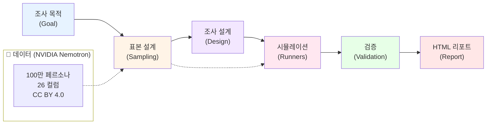

# power-persona-sim

[](https://huggingface.co/datasets/nvidia/Nemotron-Personas-Korea)

통계 정합 합성 페르소나로 인간 조사를 사전 최적화한다. NVIDIA Nemotron Personas Korea 기반 소비자 조사 시뮬레이터.

---

## 무엇을 하는 도구인가

조사 목적 한 줄을 입력하면, 100만 건의 통계 정합 합성 페르소나 중에서 목적에 맞는 표본을 골라내고, 그 페르소나들에게 설문과 심층인터뷰를 실행해 결과를 돌려준다.

```
입력   조사 목적 + 대상 조건
  │
  ├─ ① 페르소나 선별    100만 건 → 조건 매칭 → 셀 할당 → 표본 확정
  ├─ ② 조사 설계        Goal → Knowledge → Question 백워드 디자인
  ├─ ③ 시뮬레이션 실행   페르소나별 시스템 프롬프트 조립 → 배치 실행
  ├─ ④ 타당성 검증      분포 적합도 · known-truth · 자기일관성 · 멀티모델 교차
  └─ ⑤ 리포트           세그먼트별 결과 + 실제 조사로 넘길 가설
```

## 아키텍처 — 선별·설계·실행·검증·리포트 5단계



### 설계 결정

**① 프롬프트 생성 대신 통계 표본 추출**
- **포기한 것**: 신속성. 프롬프트로 즉석 페르소나를 만드는 쪽이 훨씬 빠르다.
- **선택한 것**: 국가 통계에 정합한 데이터셋(KOSIS·대법원·건보공단·KREI 시드)에서 3단계 필터로 표본 추출.
- **근거**: 프롬프트로 만든 페르소나는 만든 사람의 편견을 그대로 반영하고 대표성 근거가 없다. 분포에서 뽑은 표본은 그렇지 않다 — 이 차이가 이 도구의 존재 이유다.

**② 절대 수치 표시 금지, 상대 비교만**
- **포기한 것**: "43%가 동의" 같은 결론의 명확성.
- **선택한 것**: 세그먼트 간 상대 순위와 차이(delta)만 리포트에 표시. 리포트 템플릿이 평균·비율 표시를 구조적으로 막는다.
- **근거**: LLM 실리콘 샘플이 극단값을 크게 과대 추정한다는 실증 연구(아래 문헌). 절대 수준은 버리고 방향과 순위만 취하는 것이 방법론적으로 정직하다.

**③ 4단계 검증, 실패 시 전량 폐기**
- **포기한 것**: 빠른 결과 도출. known-truth 재현 실패 한 건이면 시뮬레이션 전체를 버린다.
- **선택한 것**: 분포 χ²(KOSIS 실측 기준분포 대조) · known-truth 재현율 · 자기일관성(반복 간 Kendall τ) · 멀티모델 교차검증.
- **근거**: 검증 없는 시뮬레이션 결과는 "그럴듯해 보이는데 사실은 틀린" 최악의 산출물이다. 걸러진 결과만이 인간 조사를 줄여줄 수 있다.

**④ CLI 배치 + 사전 등록(PREREG)**
- **포기한 것**: 웹 앱의 상호작용성(필터링·드릴다운).
- **선택한 것**: dry-run 기본 → 비용 추정 게이트 → 승인 후 실행 → jsonl 로그(시드 포함)·resume.
- **근거**: 수백 명 배치는 실제 API 비용이 발생하므로 우발 실행을 구조로 막는다. 프롬프트·모델·시드를 사후 변경하면 결론이 뒤집히는 분석 자유도 문제(arXiv 2509.13397)가 있어 PREREG.md에 사전 고정한다.

**⑤ 케이스와 엔진의 분리**
- **포기한 것**: 첫 케이스(갈비찜 브랜드)에 최적화된 지름길.
- **선택한 것**: 카테고리 지식은 전부 설정 파일로(`configs/signals/*.yaml`), 케이스 산출물은 `cases/`로 격리. 본체는 도메인 중립.
- **근거**: 신호 키워드 사전 하나만 갈아끼우면 다른 카테고리 조사가 되도록 — 도구이지 일회성 분석이 아니다.

## 포지셔닝

이 도구는 인간 조사를 **대체하지 않는다.** 실제 가치는 인간 IDI 15명을 하기 전에 시뮬레이션 300명으로 문항을 다듬고 가설을 10개에서 3개로 줄이는 데 있다.

| 구분 | 일반적 접근 | power-persona-sim |
|---|---|---|
| 페르소나 출처 | 프롬프트로 즉석 생성 | **국가 통계에 정합한 실제 분포에서 표본 추출** |
| 대표성 | 근거 없음 | KOSIS·대법원·건보공단·KREI 기반, 셀 가중치 보정 |
| 결과 신뢰 | 나온 대로 사용 | **4단계 검증 통과분만 채택, 실패 시 폐기** |
| 포지셔닝 | 인간 조사 대체 주장 | 인간 조사의 **사전 최적화·가설 축소** |

## 사용법

### 설치

```bash
git clone https://github.com/Power-xc/power-persona-sim.git
cd power-persona-sim
python3 -m venv .venv && source .venv/bin/activate
pip install -e .
```

### CLI — 파이프라인 5커맨드

```bash
# ① 표본 추출 (오프라인 fixture / DuckDB 원격 / 로컬 parquet)
power-persona-sim sample --source fixture --seed 42

# ② 설계 검증 — 커버리지 규율(레버↔지식↔문항 매핑)과 문항 무결성
power-persona-sim design-check cases/cheongwayeon/design/survey.yaml

# ③ 실행 — 기본은 dry-run: 예상 요청 수·비용만 표시하고 멈춘다
power-persona-sim run cases/cheongwayeon/design/survey.yaml --source fixture --adapter mock
power-persona-sim run ... --no-dry-run --out-dir results   # 응답 jsonl + manifest 저장

# ④ 검증 — KOSIS 실측 기준분포와 χ² 대조 + known-truth·일관성·교차검증
power-persona-sim validate results/raw/RUN_ID.jsonl \
  --survey cases/cheongwayeon/design/survey.yaml \
  --manifest results/RUN_ID.manifest.json \
  --benchmark configs/benchmarks/population-kr.yaml

# ⑤ 리포트 — 검증 판정을 품은 self-contained HTML
power-persona-sim report results/raw/RUN_ID.jsonl \
  --survey cases/cheongwayeon/design/survey.yaml \
  --manifest results/RUN_ID.manifest.json --out results/report
```

## 첫 케이스 — 청와연 靑瓦宴

가상의 갈비찜 RMR 브랜드로 도구 전체를 검증한다. 이름이 격식(명절·잔치) 쪽으로 기울어 있어, "일상 수요층이 브랜드를 고려군에서 배제하는 원인이 제품이 아니라 이름·톤에서 발생한다"는 가설(H1)을 시뮬레이션으로 검증하도록 설계했다. 설계 전문은 [`cases/cheongwayeon/`](cases/cheongwayeon/) — 목표·지식블록 K1~K10·설문 30문항·60분 IDI 가이드·제품 스펙.

## 한계 (설계 전제)

- **절대 수치 금지**: 척도 문항의 평균이나 비율(%)을 신뢰하면 안 된다. 세그먼트 간 상대 순위와 차이(delta)만 의미있다.
- **표면 패턴**: LLM 페르소나는 표면 상관은 재현하나 심층 행동 규칙성은 실패한다. 신규 발견용이 아니라 가설 선별용.
- **분산 축소**: RLHF 모델은 표현이 정제되어 태도 분산이 실제보다 작다. temperature와 반복 샘플링으로 보정 필요.
- **정형화된 잡식성**: LLM 대리응답자는 실제보다 균일하게 폭넓은 취향을 보인다.
- **인간 캘리브레이션 필수**: 검증 단계 ④(인간 소수 표본)가 없으면 결과를 의사결정에 직접 사용하지 말 것.

## 데이터셋

- **리포**: [nvidia/Nemotron-Personas-Korea](https://huggingface.co/datasets/nvidia/Nemotron-Personas-Korea)
- **규모**: 1,000,000 레코드, 약 17억 토큰, Parquet 1.98 GB
- **라이선스**: CC BY 4.0 — 상업적 이용 가능, **저작자 표시 의무**
- **통계 근거**: KOSIS, 대법원, 건보공단, KREI 식품소비행태조사(2024)

## 문헌

- [Hullman et al. — Validating LLM simulations as behavioral evidence](https://mucollective.northwestern.edu/files/Hullman-llm-behavioral.pdf)
- [arXiv 2402.18144 — Random Silicon Sampling](https://arxiv.org/pdf/2402.18144)
- [arXiv 2510.11408 — Valid Survey Simulations with Limited Human Data](https://arxiv.org/pdf/2510.11408)
- [arXiv 2509.13397 — The threat of analytic flexibility in using LLMs to simulate human data](https://arxiv.org/pdf/2509.13397)

## 라이선스

MIT — 본 프로젝트 코드는 MIT로 배포됩니다.

사용하는 NVIDIA Nemotron Personas Korea 데이터셋은 CC BY 4.0으로 배포됩니다. 자세한 내용은 [ATTRIBUTION.md](ATTRIBUTION.md)를 참조하세요.

## 저작자 표시

NVIDIA 및 Nemotron은 NVIDIA Corporation의 상표입니다. 본 프로젝트는 NVIDIA와 제휴하거나 승인받은 관계가 아닙니다.
