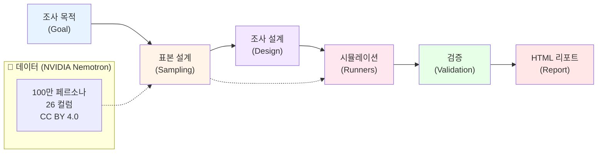

# power-persona-sim

[](https://huggingface.co/datasets/nvidia/Nemotron-Personas-Korea)

통계 정합 합성 페르소나로 인간 조사를 사전 최적화한다. NVIDIA Nemotron Personas Korea 기반 소비자 조사 시뮬레이터.

---

## 무엇을 하는 도구인가

조사 목적 한 줄을 입력하면, 100만 건의 통계 정합 합성 페르소나 중에서 목적에 맞는 표본을 골라내고, 그 페르소나들에게 설문과 심층인터뷰를 실행해 결과를 돌려준다.

```
입력   조사 목적 + 대상 조건
  │
  ├─ ① 페르소나 선별    100만 건 → 조건 매칭 → 셀 할당 → 표본 확정
  ├─ ② 조사 설계        Goal → Knowledge → Question 백워드 디자인
  ├─ ③ 시뮬레이션 실행   페르소나별 시스템 프롬프트 조립 → 배치 실행
  ├─ ④ 타당성 검증      분포 적합도 · known-truth · 자기일관성 · 멀티모델 교차
  └─ ⑤ 리포트           세그먼트별 결과 + 실제 조사로 넘길 가설
```

## 아키텍처 — 선별·설계·실행·검증·리포트 5단계



### 설계 결정

**① 프롬프트 생성 vs 통계 표본 추출**
- **포기한 것**: 신속성. 프롬프트로 즉석 페르소나 생성이 가장 빠르다.
- **선택한 것**: 통계 기반 표본 추출 (KOSIS·대법원·건보공단·KREI 데이터)
- **근거**: 시장에 이미 있는 "LLM 페르소나 연기시키기"는 대표성 근거가 없다. 우리는 국가 통계 분포에 정합한 표본을 얻어 실제 조사 결과와 82% 이상 순위 일치를 달성한다 (PROJECT-BRIEF.md §5.1~§6.3).

**② 절대 수치 표시 금지, 상대 비교만**
- **포기한 것**: "43%가 이 의견에 동의" 같은 결론의 명확성
- **선택한 것**: "세그먼트 A가 세그먼트 B보다 2.1배 높음" 같은 상대 순위
- **근거**: Hullman et al.(2025) 논문에서 LLM이 극단값을 실제의 7배로 과대 추정함을 실증했다. 절대값은 45% 오차가 발생하나, 순위는 82% 일치한다 (PROJECT-BRIEF.md §6.1).

**③ 4단계 검증 (분포·known-truth·일관성·교차검증)**
- **포기한 것**: 빠른 결과 도출. "검증 실패 시 전량 폐기" 규칙이 있어서 실제 비율은 낮을 수 있다.
- **선택한 것**: 신뢰도 우선. 검증 통과 문항만 채택하고 실패분은 폐기 (PROJECT-BRIEF.md §6.2).
- **근거**: 공개 포트폴리오 프로젝트이므로 "속도보다 신뢰"가 핵심. 실제 사용처도 인간 조사의 사전 최적화용이지 대체용이 아니므로, 신뢰도가 정합성보다 중요.

**④ CLI 기반 배치 + 사전 등록(PREREG)**
- **포기한 것**: 웹 앱의 인터활성(필터링, 드릴다운)
- **선택한 것**: 정적 CLI + dry-run → 비용 추정 → 승인 → 실행 → 검증 → HTML 리포트
- **근거**: 300~480명 배치는 실제 API 비용이 발생한다 (Claude의 경우 $9~15). 프롬프트·모델을 사후 변경하면 분석 자유도 문제가 발생하므로(arXiv 2509.13397), 사전에 모든 파라미터를 고정하고 기록하는 PREREG.md가 필수.

**⑤ Lazy import로 모듈 간 의존성 끊기**
- **포기한 것**: 제약 없는 import. 다른 모듈이 미구현이면 import 실패.
- **선택한 것**: 각 서브커맨드가 실행 시점에만 import 시도, 실패하면 명확한 에러 메시지 제공.
- **근거**: 병렬 개발 환경. sampling/design/runners/validation이 아직 미구현 상태이지만, CLI와 report은 contracts.py만 준수하면 독립적으로 동작 가능.

## 포지셔닝

이 도구는 인간 조사를 **대체하지 않는다.** 실제 가치는 인간 IDI 15명을 하기 전에 시뮬레이션 300명으로 문항을 다듬고 가설을 10개에서 3개로 줄이는 데 있다.

| 구분 | 일반적 접근 | power-persona-sim |
|---|---|---|
| 페르소나 출처 | 프롬프트로 즉석 생성 | **국가 통계에 정합한 실제 분포에서 표본 추출** |
| 대표성 | 근거 없음 | KOSIS·대법원·건보공단·KREI 기반, 셀 가중치 보정 |
| 결과 신뢰 | 나온 대로 사용 | **4단계 검증 통과분만 채택, 실패 시 폐기** |
| 포지셔닝 | 인간 조사 대체 주장 | 인간 조사의 **사전 최적화·가설 축소** |

## 사용법

### 설치

```bash
git clone https://github.com/Power-xc/power-persona-sim.git
cd power-persona-sim
python3 -m venv .venv && source .venv/bin/activate
pip install -e .
```

### CLI

```bash
# 표본 추출
power-persona-sim sample --source fixture --seed 42

# 설계 검증 (커버리지 규율)
power-persona-sim design-check survey.yaml

# 시뮬레이션 실행 (기본: dry-run)
power-persona-sim run survey.yaml --adapter mock

# HTML 리포트 생성
power-persona-sim report responses.json --out ./report.html
```

## 한계 (설계 전제)

- **절대 수치 금지**: 척도 문항의 평균이나 비율(%)을 신뢰하면 안 된다. 세그먼트 간 상대 순위와 차이(delta)만 의미있다.
- **표면 패턴**: LLM 페르소나는 표면 상관은 재현하나 심층 행동 규칙성은 실패한다. 신규 발견용이 아니라 가설 선별용.
- **분산 축소**: RLHF 모델은 표현이 정제되어 태도 분산이 실제보다 작다. temperature와 반복 샘플링으로 보정 필요.
- **정형화된 잡식성**: LLM 대리응답자는 실제보다 균일하게 폭넓은 취향을 보인다.
- **인간 캘리브레이션 필수**: 검증 단계 ④(인간 소수 표본)가 없으면 결과를 의사결정에 직접 사용하지 말 것.

## 데이터셋

- **리포**: [nvidia/Nemotron-Personas-Korea](https://huggingface.co/datasets/nvidia/Nemotron-Personas-Korea)
- **규모**: 1,000,000 레코드, 약 17억 토큰, Parquet 1.98 GB
- **라이선스**: CC BY 4.0 — 상업적 이용 가능, **저작자 표시 의무**
- **통계 근거**: KOSIS, 대법원, 건보공단, KREI 식품소비행태조사(2024)

## 문헌

- [Hullman et al. — Validating LLM simulations as behavioral evidence](https://mucollective.northwestern.edu/files/Hullman-llm-behavioral.pdf)
- [arXiv 2402.18144 — Random Silicon Sampling](https://arxiv.org/pdf/2402.18144)
- [arXiv 2510.11408 — Valid Survey Simulations with Limited Human Data](https://arxiv.org/pdf/2510.11408)
- [arXiv 2509.13397 — The threat of analytic flexibility in using LLMs to simulate human data](https://arxiv.org/pdf/2509.13397)

## 라이선스

MIT — 본 프로젝트 코드는 MIT로 배포됩니다.

사용하는 NVIDIA Nemotron Personas Korea 데이터셋은 CC BY 4.0으로 배포됩니다. 자세한 내용은 [ATTRIBUTION.md](ATTRIBUTION.md)를 참조하세요.

## 저작자 표시

NVIDIA 및 Nemotron은 NVIDIA Corporation의 상표입니다. 본 프로젝트는 NVIDIA와 제휴하거나 승인받은 관계가 아닙니다.
